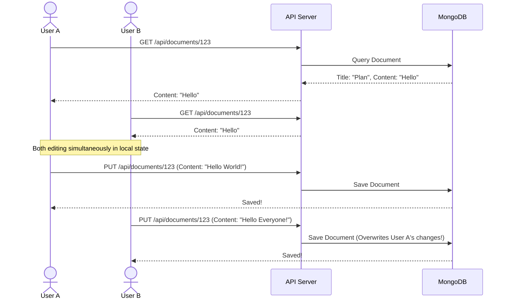
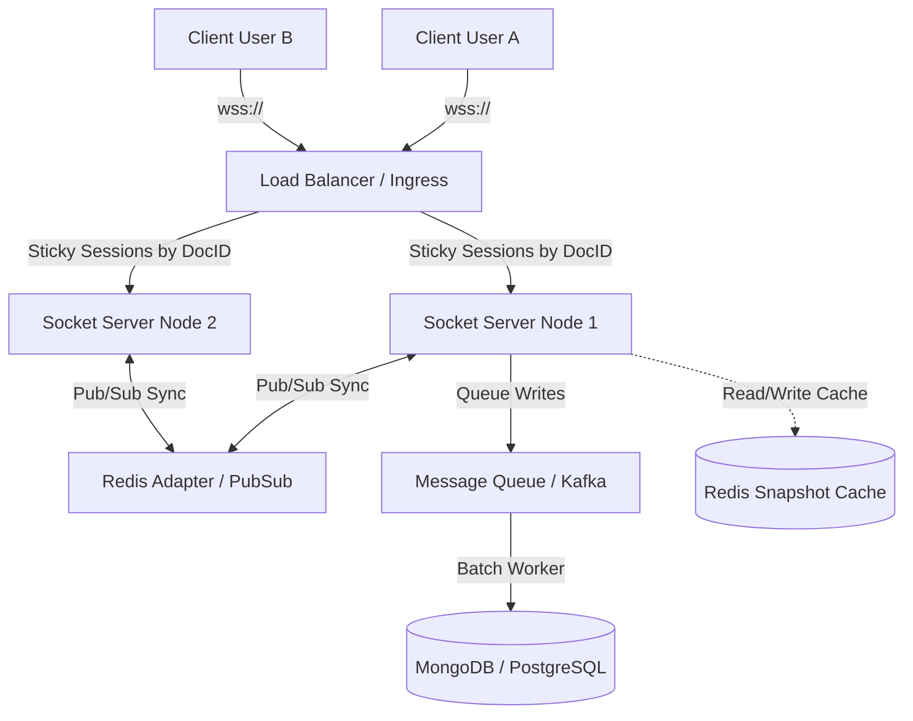

# 🧠 Designing Collaborative Editing: Sandbox vs. Global Scale

This document explores how our sandbox collaborative document editor works, its structural limitations, and how we would re-architect it to support real-time, low-latency collaboration at a global scale (similar to Google Docs or Notion).

---

## 📁 1. How Our Sandbox Model Works

Currently, this project uses an **on-demand, document-level CRUD (Create, Read, Update, Delete) collaboration model**. 



### Key Components of the Sandbox:
1. **Access Control (Document Schema)**:
   - The [Document model](../server/models/Document.js) stores an `owner` (ObjectId linking to a User) and a `collaborators` list (array of ObjectIds).
   - Middleware and controllers verify that the requesting user's ID matches either the owner or is present in the collaborators array.
2. **On-Demand Saving**:
   - The frontend maintains the document text in a local React state (`title` and `content`).
   - When the user clicks **Save Document**, the frontend sends a `PUT` request containing the *entire* text body of the document to the server.
3. **Implicit Sharing**:
   - Sharing is done by looking up a user by `username` and appending their `_id` to the document's `collaborators` array in MongoDB.

### ⚠️ Limitations of the Sandbox Model:
- **Last-Write-Wins Conflict**: If User A and User B open the same document, and both make edits, whoever clicks "Save" last will overwrite the other's changes completely.
- **No Real-Time Synchrony**: Users have to refresh their pages or wait for a fetch loop to see changes made by others.
- **Lack of Awareness**: There is no visual feedback showing who is currently online or where their cursors are positioned.

---

## ⚡ 2. Shifting to Real-Time: Transport & Communication

To support live co-editing, we must transition from HTTP REST polls to a **bidirectional, event-driven transport layer**.

### WebSockets (WS / WSS)
Instead of sending requests and waiting for responses, the client and server maintain a persistent TCP connection. We can use libraries like **Socket.io** or native WebSockets.
*   **Action Flow**: Whenever User A types a character, a socket message is sent. The server processes this change and broadcasts it to all other active sockets connected to that document room.

```
[Client User A] ──(Edit Event)──> [Websocket Server] ──(Broadcast)──> [Client User B]
```

---

## 🧮 3. Conflict Resolution Algorithms

When multiple users edit the same document in real time, local changes must be merged without breaking text layout or causing desynchronization. There are two industry-standard approaches to resolving conflicts:

### A. Operational Transformation (OT)
*Used by Google Docs and Apache Wave.*
*   **Core Concept**: Instead of sending the full text, clients send **Operations** (e.g., `Insert(index: 5, char: 'a')` or `Delete(index: 10, length: 2)`).
*   **The Transform Logic**: If User A and User B execute concurrent edits, the server *transforms* the index coordinates of one operation relative to the other.
*   **Example**:
    *   Document content is `"cat"`.
    *   User A inserts `"s"` at index 3 (`"cats"`).
    *   User B inserts `"c"` at index 0 (`"ccat"`).
    *   If User A's operation reaches the server first, User B's operation must be transformed: its index increases by 1 to account for the new character `"s"`. The final merged result becomes `"cccats"`.

### B. Conflict-Free Replicated Data Types (CRDTs)
*Used by Figma, Notion, Yjs, and Automerge.*
*   **Core Concept**: A data structure where operations are designed to be mathematically commutative and associative. No matter what order updates arrive in, once all updates are received, every client arrives at the exact same state.
*   **How it works**: Every character in the document is assigned a globally unique identifier (e.g., a tuple containing a client ID and a sequential logical timestamp).
*   **Comparison Table**:

| Feature | Operational Transformation (OT) | Conflict-Free Replicated Data Types (CRDTs) |
| :--- | :--- | :--- |
| **Logic Location** | Centralized (requires a single server to act as a single source of truth to order events). | Distributed (can merge peer-to-peer without a centralized server). |
| **Complexity** | Very complex to write transform matrices for rich formatting. | High memory consumption (each character needs metadata identifiers). |
| **Offline Editing** | Difficult to merge long offline edits. | Very clean; offline edits merge natively using unique identifier graphs. |

---

## 🌐 4. Scaling the Architecture to Millions of Users

To scale a collaborative document system to handle millions of active sheets, slides, or text docs, we must distribute users across multiple application servers.



### 1. Sticky Load Balancing & WebSocket Gateways
WebSockets require a persistent state. An ingress load balancer (like NGINX or Envoy) routes client connections.
- **Sticky Sessions by Document ID**: To avoid cross-node communication latency, all clients editing `Document 123` should be routed to the *same* Socket Server Node.

### 2. Redis Pub/Sub for Inter-Node Communication
If users editing the same document *are* connected to different servers, a message broker like **Redis Pub/Sub** or **RabbitMQ** syncs events between nodes:
- When Node 1 receives an edit from User A, it publishes it to a Redis channel `doc:123`.
- Node 2 is subscribed to `doc:123`, receives the event, and forwards it to User B.

### 3. Write Buffering & Databases
Writing every keystroke directly to MongoDB is highly inefficient and creates database bottlenecks.
- **Operational Log Cache**: Keystrokes are buffered in an in-memory database like **Redis** (saving a log of edits/operations).
- **Snapshot Generator**: Periodically (e.g., every 5 seconds of inactivity or every 100 operations), a background worker compiles the changes and updates the main document document in the primary relational/NoSQL database.

### 4. Client-Side Optimizations (Latency Compensation)
- **Local Prediction**: Apply changes to the local UI immediately before receiving server confirmation.
- **Undo/Redo Stack Management**: Keep track of local operations separately from incoming remote operations, so clicking "Undo" only reverts the active user's keystrokes.
- **Awareness Engine**: Broadcast cursor positions (coordinates or character indexes) as lightweight, ephemeral messages that aren't saved to the database.
